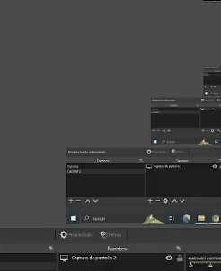

# Console based game

This project is a C++ real-time, console-based game that provides interfaces for creating customized levels and entities. It allows for the development of environments with obstacles and walls, and supports controlling an entity via the keyboard using Win32 API. The game includes a basic level with empty tiles where the entity can move freely, and walls that the entity cannot pass through. This game is extensible for further applications.

This code was developed with the help of courses and tutorials from [CodeMaster101](https://youtube.com/@codemaster101?feature=shared).
